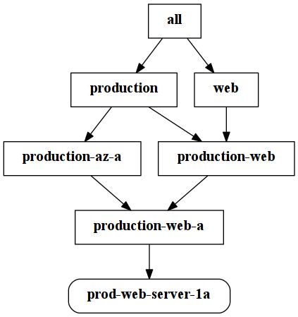

% What Ops can learn from Dev
% Will Thames
% 21 July 2016

# Overview

## About this talk

* About how Ops write, store and use code
* Configuration/Deployment/Orchestration focus
* Heavily based on my DevOps Days Melbourne talk
* But the Ansible edition

## About me

* Systems Engineer at Red Hat
* Previously at Suncorp and Betfair
* Contributor to Ansible
* Creator of ansible-lint, ansible-inventory-grapher and ansible-review

# Sharing code

## Version control

* Have some. Which one is relatively unimportant.
* Find out when something was changed, and by whom.
* See what changed, and hopefully why (needs good commit messages!)
* Go back in time - revert changes, compare differences

## Separation of code and data

* Hardcode as little as possible in your templates and task files
  (there is such thing as premature templating though!)
* Try and make it so that your code could be shared
  with the world without giving anything away

## Secrets

* You will need a solution to what to do with secrets. There are many
* ansible-vault
* Hashicorp's Vault

## Higher level languages

Why use configuration management? Surely bash scripts in an ssh loop will suffice?

Why use python or ruby? Surely assembly or C will suffice?

## Higher level languages

* Repeatability
* Error handling
* Reduction of boilerplate code
* Abstraction of patterns to higher layers
* Templating
* API calls

## Abstraction and reuse

* As with functions, modules, libraries and packages, wrap up common operations into reusable code.
* This might be a module for installing and configuring java, or deploying a particular application type.

* Ansible has roles for grouping a bunch of operations.
* Ansible has modules for creating new operations.

## Community

* Separation of code and data (particularly secret data) allows you to share your work with others.
* If you are able to share your code, others will benefit, and yet others will
    improve it.
* You can also benefit from work others have done - look for roles that others have written before writing your own.
* See Ansible Galaxy

## Data Inheritance

* Only write as much configuration as you need
* Some variables will be common to all applications across a particular environment
* Some variables will be common to all environments for a particular application
* Use Ansible groups to manage the inheritance hierarchy
* [ansible-inventory-grapher](https://github.com/willthames/ansible-inventory-grapher)
  can help show the inheritance hierarchy

## Inheritance

## Repeatability

* What happens if you run your code twice?
* What happens if the second time is six months from now?

## Versions

* Tag your roles with version numbers. Specify a version number when including
  roles with a playbook.
* Furthermore specify versions when pulling things from yum, apt-get, git, mercurial etc.

# Code quality

## Quality control

* Use the tools
* ansible-lint
* pep8, go fmt et al.
* dry run mode, diff mode

## Best practices and Standards

* Have some.
* We manage our standards and best practices as a git repo using pull requests
* Any changes/additions to best practices and standards must achieve a body of support (we use +2 overall)
* Best practices is an advisory of things to consider
* Standards are a set of tests, preferably automatable

## Code reviews

* All code reviews should be objective. If you're objecting to a style issue, it should be written down (internally or using an existing style guide for a language/framenwork)
* Have a policy on what level of consensus is required to accept code into the mainline codebase
* This will typically be a risk management tradeoff (we use +1 for stuff that is
    independent and can be pinned to a version, and +1 human with +1 automated
    for everything that can break a lot of stuff)
* [ansible-review](http://willthames.github.io/2016/06/28/announcing-ansible-review.html)
  can help with maintaining standards at review time.

## Testing

* Have some.
* Production-like environments
* Virtual machines
* Containers
* AWS/GCE/Azure etc
* Anything that isn't "your machine" - needs to be configured using the same tooling as live.

## Continuous Integration

Pipeline:

* Commit &rarr;
* Checkout &rarr;
* Static analysis &rarr;
* Automated provisioning &rarr;
* Apply configuration &rarr;
* Run test suite (e.g. serverspec)

# Thanks

## Questions?

## Slides

https://willthames.github.io/ansible-brisbane-07-2016

